# Portfolio Website #

## Links ##

[Portfolio Website](https://jordanfasso.netlify.com/)

[Git Repository](https://github.com/joryaboya/my-portfolio)
_________

## __About__ ## 

This website was built with the intention of displaying my abilities as a developer in terms of design and skills. It also includes some context with regard to who I am as a person which is also expressed through the design. 

The site itself is entirely presented on one page, with it divided into five sections as shown by the site map below. Key features include the navigation bar which is on the left hand side of the page, and the large view covering images that signify each section of the website. The website was built purely using HTML and CSS, including the animations of glitch loading the content on each page, and the glitchy links on the navigation bar icons. 

This website was deployed using Netlify in conjunction with the GitHub repository where the filesystem is located.

Some stretch goals would include being able to trigger the content animations on scroll or on link to the section which is easiest to deploy using Javascript. Reformatting of the work content section would be required upon completion of new projects, as would the skills content section as I learn more languages.

_Sitemap:_ 
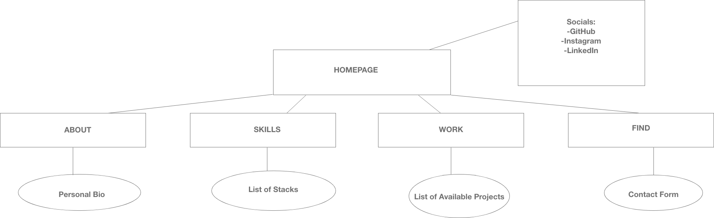

_Screenshots:_ 

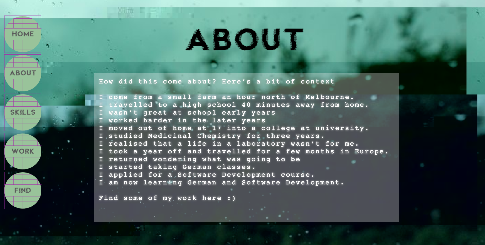

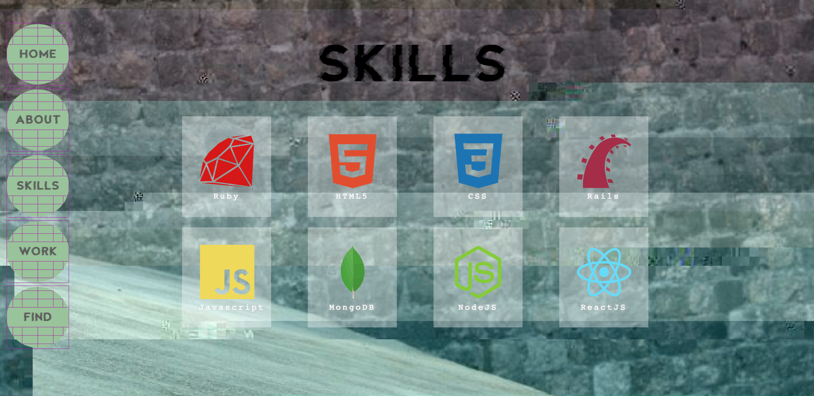

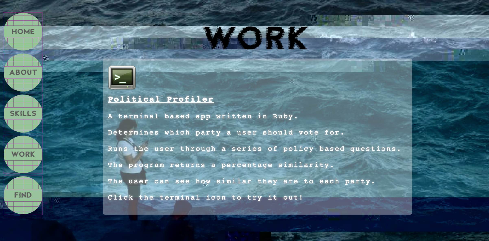

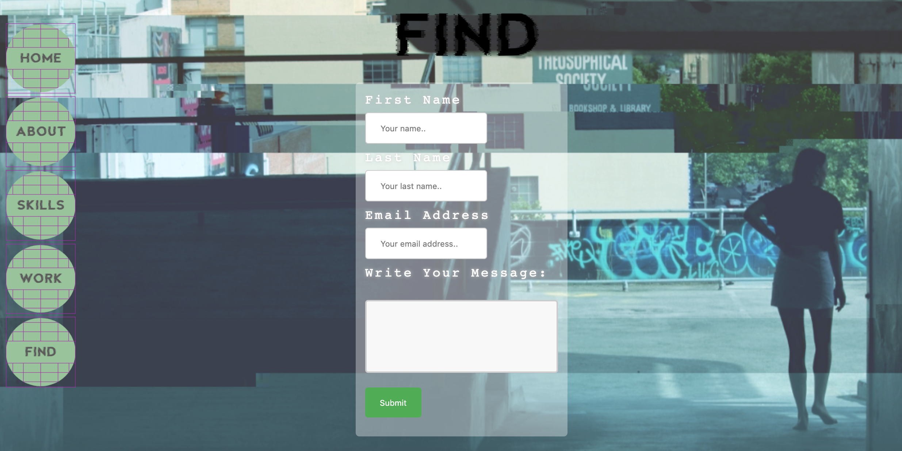

## __Design Process__ ##

_Moodboard:_

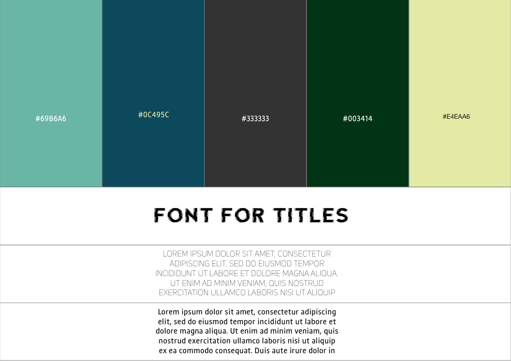

_Original Wireframes:_

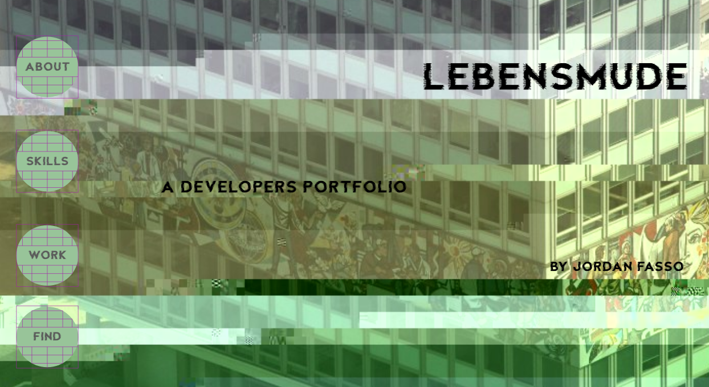

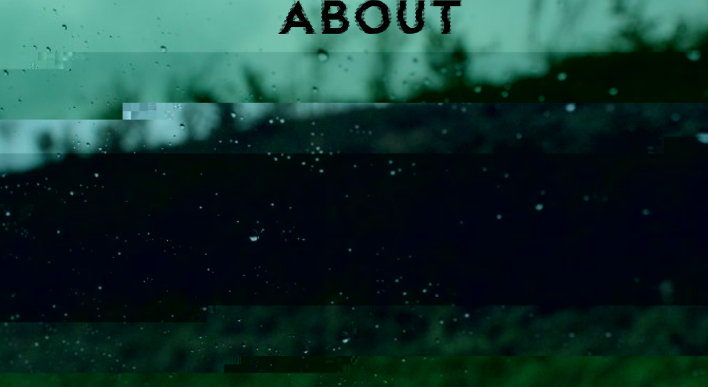

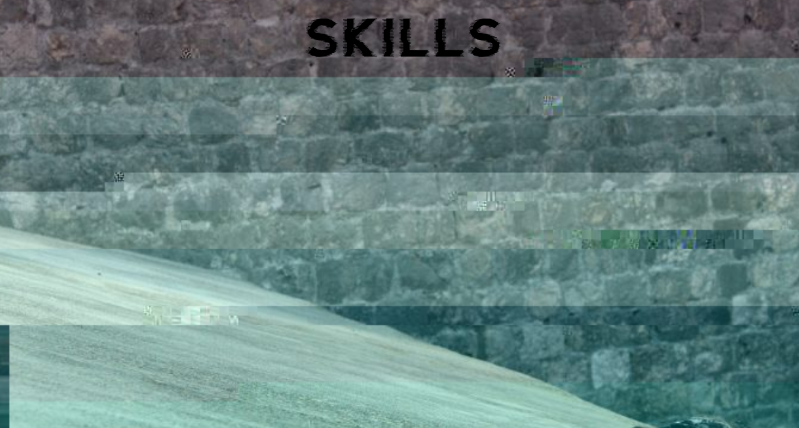

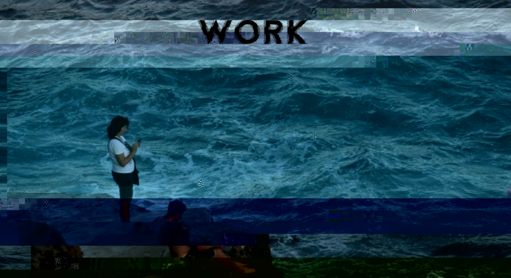

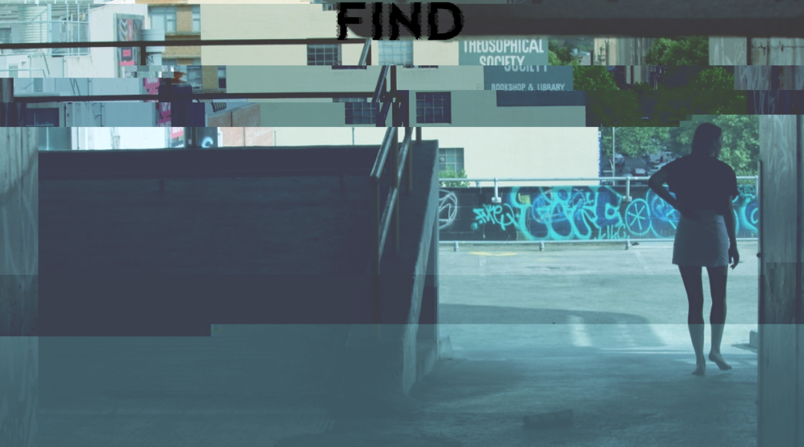

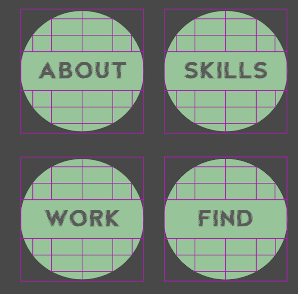

### iPhone X Background Images ###

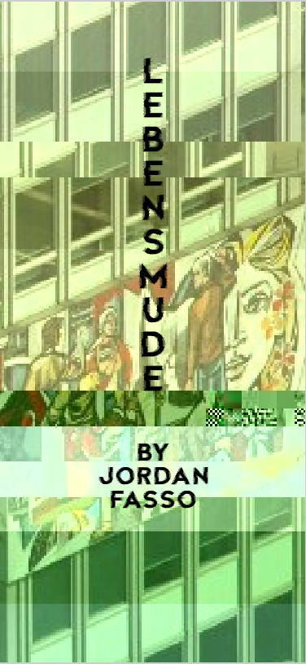
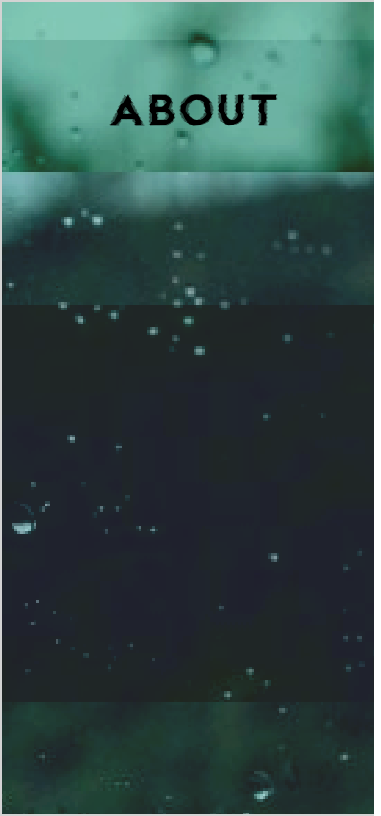
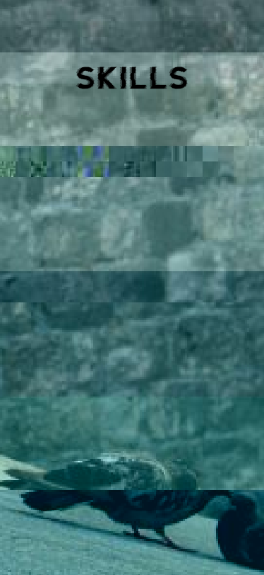
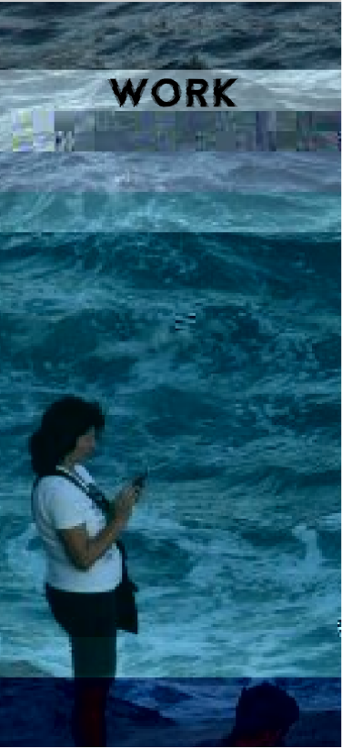
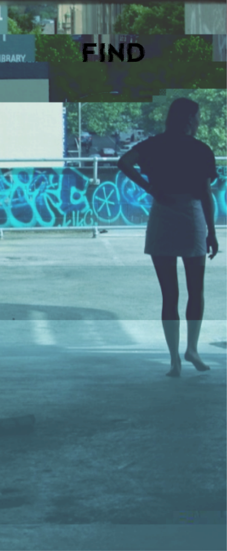

### Development ###

The first few days of the process were spent gathering inspiration from other portfolio websites, designing moodboards, developing prototypes and wireframes. The title of the portfolio is "Lebensmüde" which directly translates from German to English as "tired-life". This is where most of the inspiration was drawn from. Once the design had a blueprint the coding began using HTML and CSS. 

AdobeXD was used to design the prototypes and background images for each section. An online photo distortion service called Snorpey was used to create the glitchy effects seen on the background images. The images themselves were originals taken throughout Europe and Australia. 

Initially it was difficult to apply a format that would allow the site to work before deciding that wrapping the website in a grid which had five sections would best display the content. This was because having each section filling the page allows the background images to heavily feature and be the focal points. A media query was generated for the iPhone X dimensions, where different backgrounds were used for the sections as the original background images did not fit a portrait screen.

The basic font of monospace was used for the content because it doesnt detract from the other features in the website, namely the animation effects on the nav bar and content. The other font used in the titles and nav bar is called Fault, which adds to the glitchy, dystopic nature of the design. 

The site was developed with the intention of attracting those who might be potential employers or those interested in coding generally.

### Trello Board ###
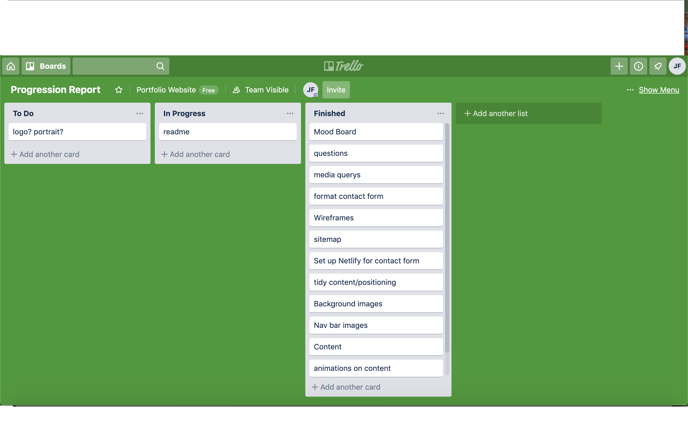

### Stretch Goals ###

* Have the content animations load when the in page link is clicked or upon scrolling 
* Have a terminal emulator that would be able to run the Political Profiler app within the website further showcasing abilities
* Have a method set up that would make the website less static in terms of updating content (ie being able to add skills and work easier)
* Have a loading screen to allow page to completely load prior to view

__________
## __Questions__ ##

__Describe key events in the development of the internet from the 1980s to today (max. 150 words)__

* The standard protocol of the connected internet being Transmission Control Protocol (TCP) and Internet Protocol (IP) was established in 1982.
* The Domain Name System (DNS) was developed in 1983 to assist in the naming of websites. 
* Symbolics.com was the first registered domain in 1985. 
* NSFNET was made active to connect to supercomputer centres at speeds of 56000b/s. 
* In 1989 world.std.com was the first commercial internet provider.
* In 1990 HTML was developed before the World Wide Web was available to the public the year later. 
* 1992 audio and video files were made available for distribution on the internet. 
* 1994 Microsoft developed a web browser for Windows 95. 
* Marketplace sites such as Amazon and eBay go live in 1995. 
* Google search engine in created 1998. 
* Facebook was made available in 2004 starting social media craze. 
* 2012 fair use laws introduced in America. 
* 2016 Google Assistant released marking start of AI industry.

__Define and describes the relationship between fundamental aspects of the internet such as: domains, web servers, DNS, and web browsers (max. 150 words)__

When a domain is entered into the internet browser it obtains the IP address and the website loads. The process starts with a check on the browsers local cache. If you have been to this domain recently it will already know the IP, or if it isn’t there it will check the computers DNS cache. If it still cant find the IP it reaches out to a Recursive DNS server, located at Internet Service Provider which then returns IP from their cache. If still the IP is not obtained from ISP servers then it is referred to Root DNS servers, where the request is redirected to the name servers for requested top-level domain (TLD) which contain the access to Authoritative DNS servers such as .com, .org and .net. The Authoritative Name Servers give us the information required, and the IP is cached by our computer.  

__Reflect on one aspect of the development of internet technologies and how it has contributed to the world today (max. 150 words)__

Online shopping has become increasingly available in proportion to the growth of the internet. 1995 was a siginificant year for online shopping as Amazon and eBay launched their websites. These online marketplaces have provided not only convenience to all those who participate but the level of economic growth is staggering with revenues of 4.88 trillion US dollars projected to be generated in 2021 worldwide. An industry that was effectively non-existent prior to Amazon and eBay's growth has transformed to a multi-trillion dollar industry in just over 20 years. The internet's ability to connect people, businesses and organisations has allowed this generation far greater communication efficiency causing the exponential growth in economy, knowledge and globalisation that we are experiencing today.