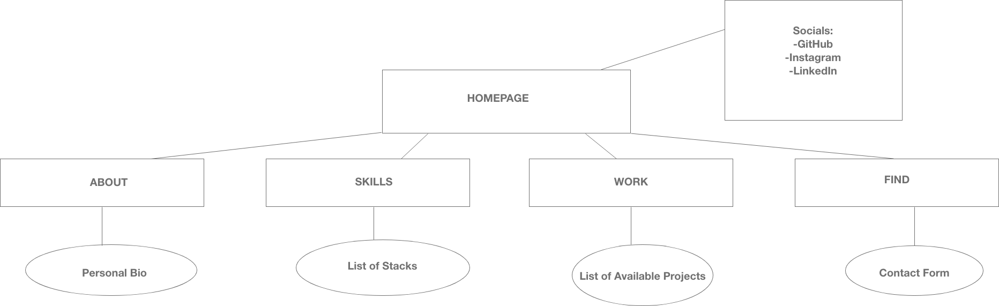
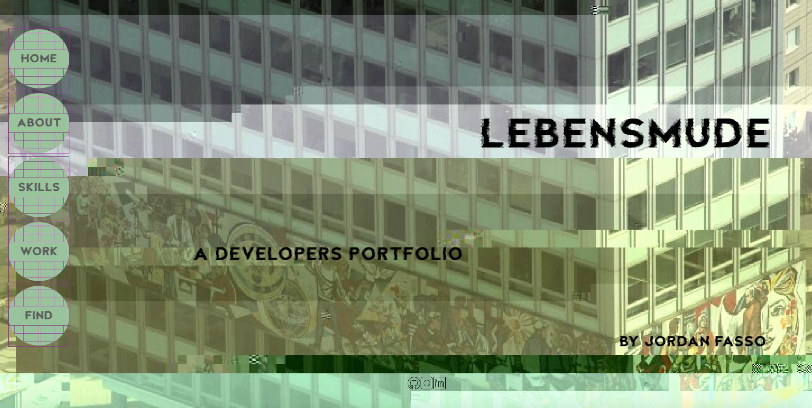
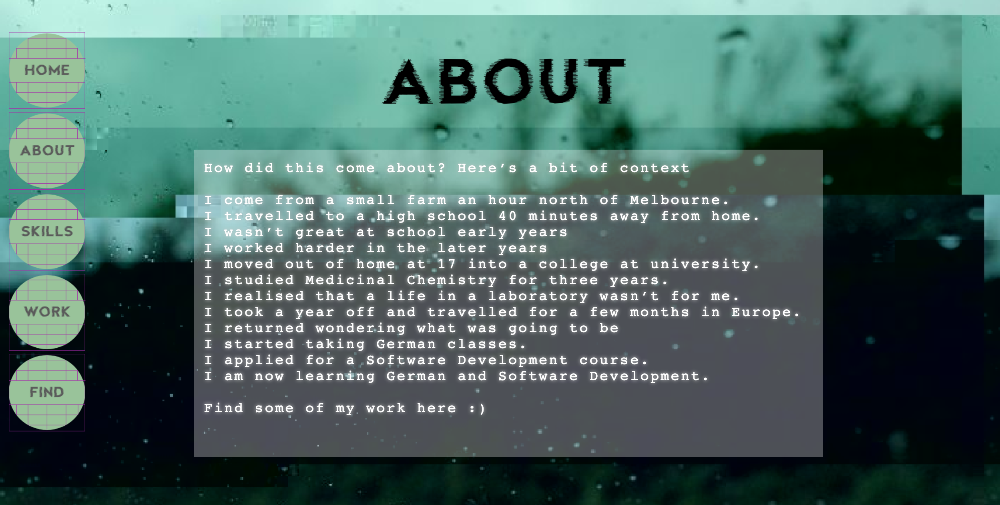
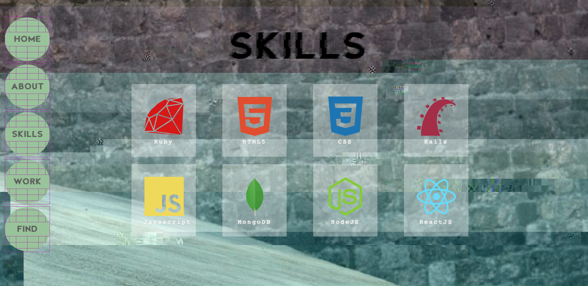
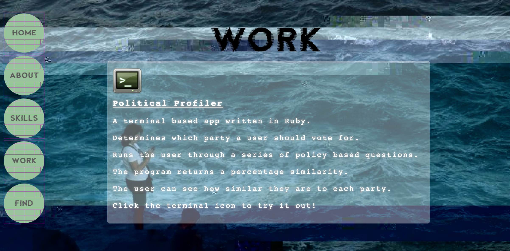
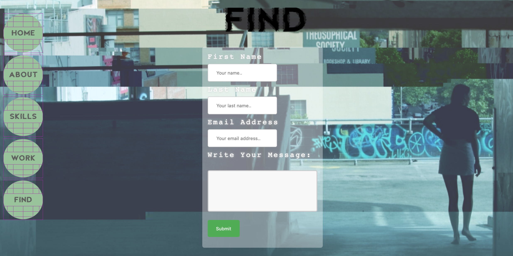

# Portfolio Website #

## Links ##

[Portfolio Website](https://dreamy-brattain-ce55e8.netlify.com/)

[Git Repository](https://github.com/joryaboya/my-portfolio)
_________

## __About__ ## 

This website was built with the intention of displaying my abilities as a developer in terms of design and skills. It also includes some context with regard to who I am as a person which is also expressed through the design. 

The site itself is entirely presented on one page, with it divided into five sections as shown by the site map below. Key features include the navigation bar which is on the left hand side of the page, and the large view covering images that signify each section of the website. The website was built purely using HTML and CSS, including the animations of glitch loading the content on each page, and the glitchy links on the navigation bar icons. 

This website was deployed using Netlify in conjunction with the GitHub repository where the filesystem is located.

Some stretch goals would include being able to trigger the content animations on scroll or on link to the section which is easiest to deploy using Javascript. Reformatting of the work content section would be required upon completion of new projects, as would the skills content section as I learn more languages.

_Sitemap:_ 

_Screenshots:_ 

## __Design Process__ ##

_Moodboard:_

Describe key events in the development of the internet from the 1980s to today (max. 150 words)
Define and describes the relationship between fundamental aspects of the internet such as: domains, web servers, DNS, and web browsers (max. 150 words)
Reflect on one aspect of the development of internet technologies and how it has contributed to the world today (max. 150 words)